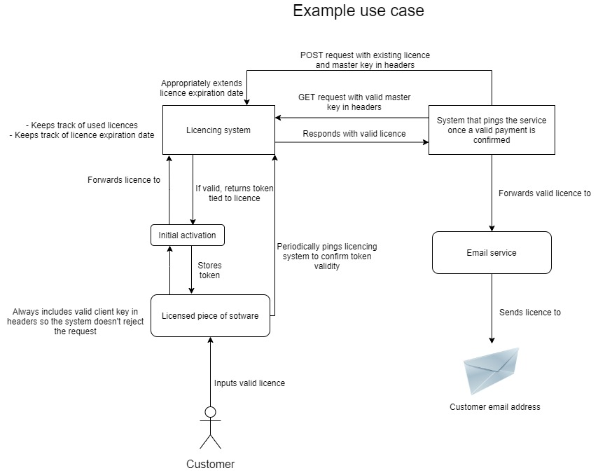

# Ciphey

Licence generation & validation. Built in Flask.

## Setup

Requirements are listed in `requirements.txt`

To use a proper database:

First you will need to set the correct database URI in `settings.py`.

Then you should remove this line `db.create_all()` in `main.py`.

Then you run the migrations using: `flask db upgrade`.

To run locally use `flask run`.

If running this on an actual server be sure to move all the secrets into ENV
variables.

This application can easily be modified or extended to fit any personal needs.
All controllers in `/controllers` can be registered in `main` as a blueprint by
simply
following the same method used to create the initial `license_controller.py`.

Models are easily added or modified in the `models` folder. They should all use
a shared
`db` object from the `shared.py` module. If you modify any models or create new
ones you will
need to create and run new migrations.

## Postman

A postman collection is included with the project under `/postman`. This gives
you an example
for accessing the endpoints and how the requests towards them should be
constructed.